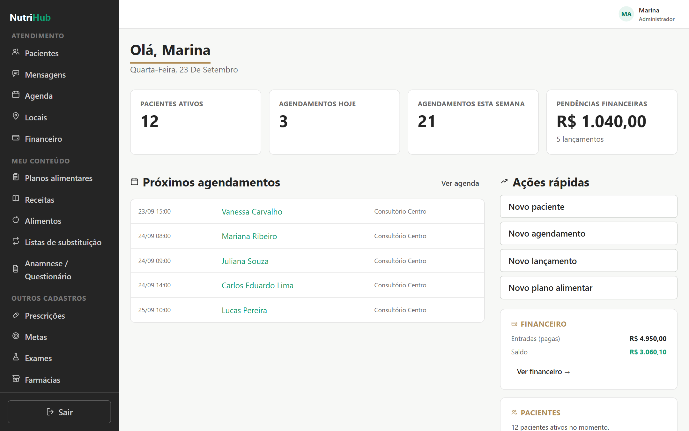
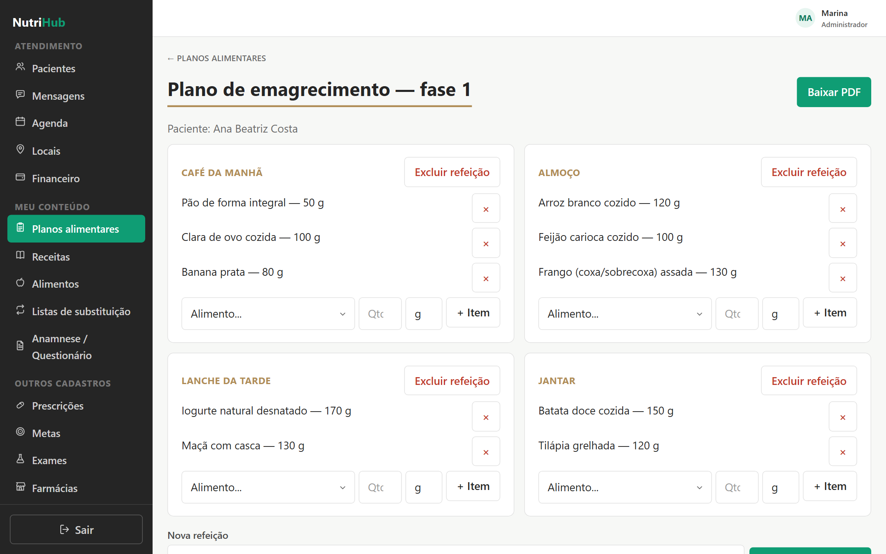
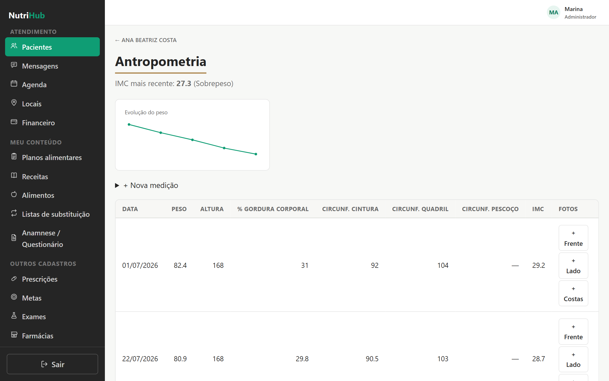
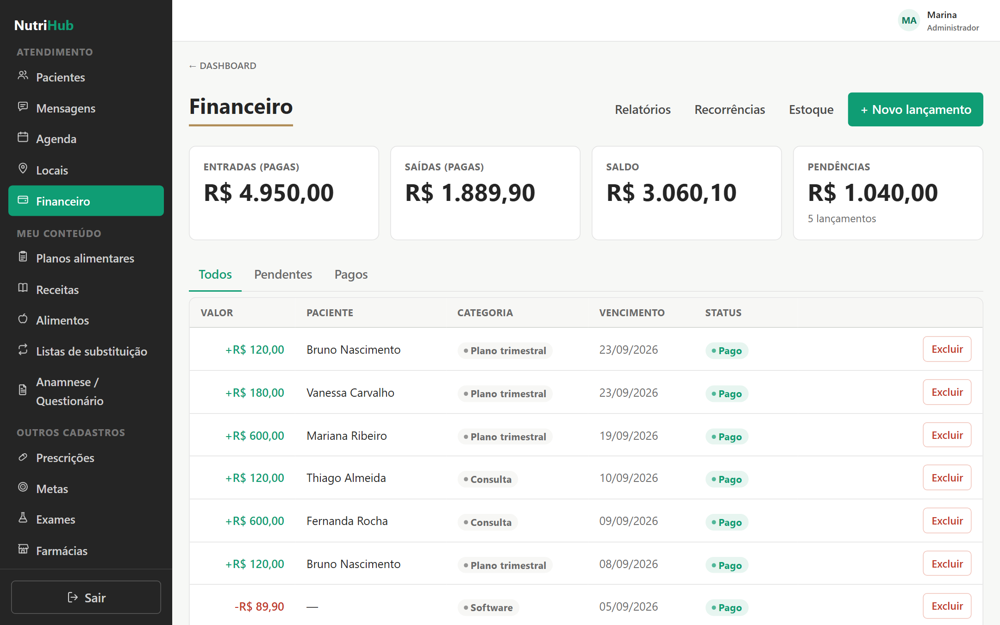
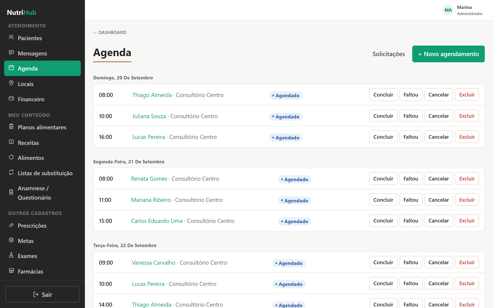
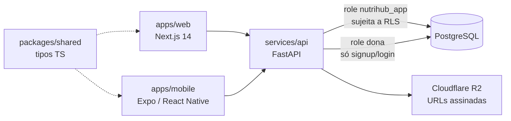

# NutriHub

> **Status: pausado.** Sistema funcional (painel web, API, app do paciente e 79 testes
> automatizados), publicado em ambiente próprio durante o desenvolvimento. Não está em
> operação comercial. O repositório fica público como base de código de portfólio.

**ERP para nutricionistas:** painel web para o profissional, app mobile para o paciente e
uma API que isola os dados de cada consultório no próprio banco de dados.

Nasceu para o consultório de uma nutricionista, a partir do mapeamento funcional de uma
ferramenta de mercado que ela já usava (`docs/mapeamento-dietbox.md`), e foi desenhado
desde o início para virar SaaS multi-tenant.



<table>
  <tr>
    <td></td>
    <td></td>
  </tr>
  <tr>
    <td></td>
    <td></td>
  </tr>
</table>

<sub>Todos os dados das imagens são fictícios, gerados por script para demonstração.</sub>

---

## O que funciona

**Consultório (painel web)**
- Pacientes, agenda, locais de atendimento e tags
- Planos alimentares com refeições, itens e **exportação em PDF**
- Base de alimentos (~90 itens de referência TACO + cadastro próprio), receitas e listas
  de substituição
- Prescrições e solicitações de exames estruturadas (não texto livre), anamnese e
  questionários, metas e antropometria com evolução e IMC
- Financeiro: fluxo de caixa, categorias, relatórios, cobrança recorrente (lançamentos) e
  estoque com venda de produtos
- Equipe com papéis (admin, nutricionista, assistente)
- Página pública por profissional com **solicitação de agendamento online**

**Paciente**
- Portal web e **app mobile (Expo/React Native)**: plano alimentar, diário alimentar,
  chat com o profissional, prescrições e metas

**Conta e segurança**
- Cadastro com Google ou e-mail com código de verificação (Resend)
- Fotos privadas (pacientes, exames) em bucket sem acesso público, lidas por URL
  assinada com expiração (Cloudflare R2)
- Paginação em todas as listagens

## O que não foi feito (e por quê)

Tudo abaixo depende de conta, credencial ou decisão de negócio externa, e não de código:
pagamento online (Stripe), lembretes por WhatsApp, faturamento de convênios (TISS),
assinatura digital ICP-Brasil, integração com Google Agenda, recursos de IA, telessaúde
e nota fiscal. O app mobile também não foi publicado nas lojas. A lista completa, com o
motivo de cada item, está em [`ARCHITECTURE.md`](ARCHITECTURE.md#explicitamente-fora-de-escopo--não-construir-sem-revisitar-a-decisão).

---

## Arquitetura



Monorepo com **pnpm workspaces + Turborepo**:

```
apps/web/          Next.js 14 (App Router) — painel do profissional, portal e página pública
apps/mobile/       Expo / React Native — app do paciente
services/api/      FastAPI — 28 routers, PDF (reportlab), autenticação JWT
packages/shared/   tipos de domínio compartilhados entre web e mobile
supabase/migrations/  22 migrations SQL versionadas
infra/             Docker Compose para desenvolvimento
```

| Camada | Tecnologia |
|---|---|
| Web | Next.js 14, TypeScript, CSS com tokens globais |
| Mobile | Expo, React Native, TypeScript |
| API | Python, FastAPI, asyncpg, pytest + httpx |
| Banco | PostgreSQL 16 com Row Level Security |
| Infra | Docker Compose; front em Cloudflare Workers (OpenNext) com deploy via Git; API via Cloudflare Tunnel |

## Decisões técnicas que valem a leitura

- **Isolamento multi-tenant em duas camadas.** Toda rota autenticada filtra por
  `tenant_id` *e* conecta como uma role sem permissão de bypass (`nutrihub_app`), com o
  tenant em uma variável de sessão do Postgres. Se alguém esquecer o filtro, o próprio
  banco bloqueia. Existe um teste que prova isso:
  `test_rls_blocks_cross_tenant_even_without_app_filter`.
- **A conexão é devolvida limpa ao pool.** A variável de tenant é resetada antes de a
  conexão voltar ao pool, para um tenant nunca vazar para a próxima requisição.
- **Um bug que só apareceu testando de verdade.** Ao adicionar `DELETE` em duas tabelas,
  a RLS passou a bloquear exclusões sem gerar erro, porque faltava uma policy para esse
  comando. Foi corrigido em `0004_delete_policies.sql` e está coberto por teste de
  regressão.
- **Escopo reduzido de propósito.** A agenda começou como lista por dia, e não como
  calendário completo, para validar o uso real antes.

## Rodando localmente

```bash
cp .env.example .env     # gere um API_SECRET_KEY próprio (instrução no arquivo)
docker compose -f infra/docker-compose.yml up --build
```

- Web: http://localhost:3000
- API: http://localhost:8000/docs
- Mobile: `cd apps/mobile && pnpm install && npx expo start` (detalhes em
  [`apps/mobile/README.md`](apps/mobile/README.md))

**Testes** (79, com a stack do Compose rodando): o comando completo está em
[`ARCHITECTURE.md`](ARCHITECTURE.md#testes-automatizados-2026-08-13).

---

## Sobre o desenvolvimento

Projeto pessoal de [Ismael Santana Silva](https://github.com/Ismael042), com Plinio e Joice
(nutricionista, usuária-piloto e fonte dos requisitos). Desenvolvido com apoio intenso de
IA (Claude Code). O levantamento de requisitos, as decisões de produto e de arquitetura,
a validação, o deploy e a depuração foram conduzidos por mim. O histórico detalhado de
decisões está em [`ARCHITECTURE.md`](ARCHITECTURE.md).

Todos os direitos reservados. O código está visível para avaliação e não licenciado para
reuso.
